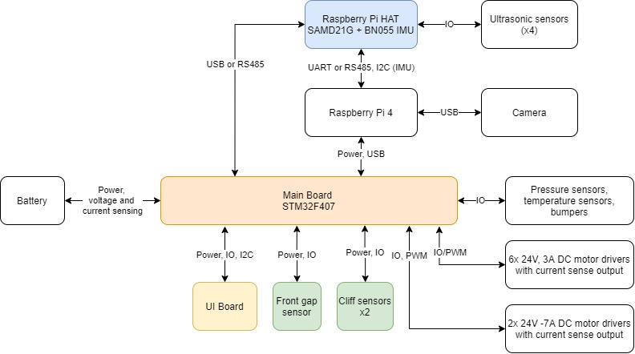

# Deck cleaning and staining robot

Hardware files for all the custom electronics in a deck cleaning and staining robot.
* Eagle files and documentation provided. See individual folder readme for details.
* Firmware for the STM32F407 was developed in C based on STM CubeMx libraries, but cannot be made public as of now.  

## Architecture

