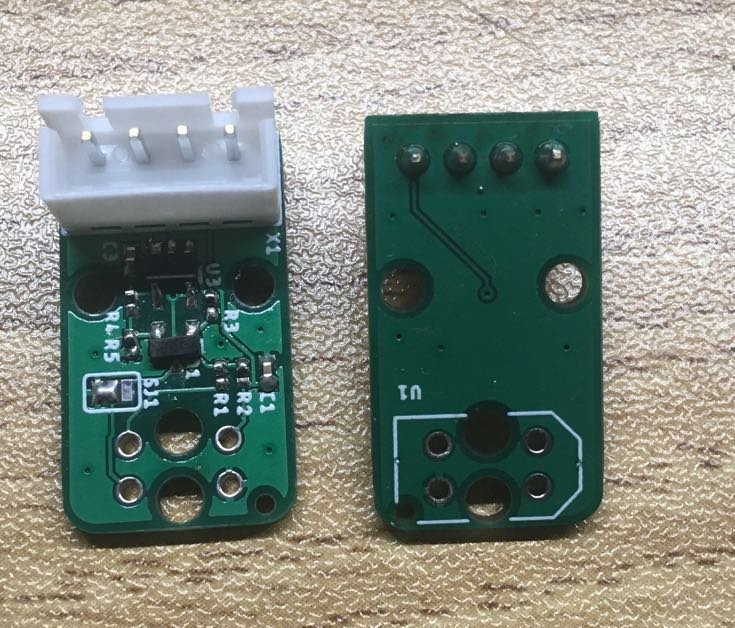
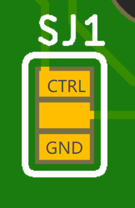

# Robodeck Cliff sensor 

## Description
This small board features a single TCRT5000 sensor and a votlage controlled current source to control the brightness of the IR LED in the sensor if needed/wanted. 
 

## Hardware connections 
JST XH Connector 4Pin, top view (left on the picture above), left to right:
- GND
- CLIFF_OUT: analog output of the cliff sensor
- CLIFF_CTRL: input to the voltage controlled current source
- 3V3

In constant current mode: 
- Solder a resistor on R1 to set the current 
- Solder JP1 to GND

In controlled current mode: 
- Connect CLIFF_CTRL signal to an analog voltage source (ex: STM32 DAC)
- Solder a 0 ohm resistor to R1
- Solder JP1 to CTRL

## Errata
Errors noted when assembling: 
- forgot to label pin signals at the back 

Testing log:
- Not tested yet

