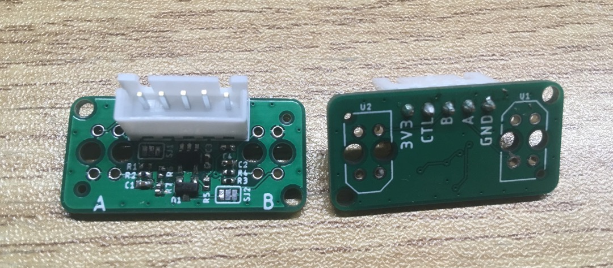
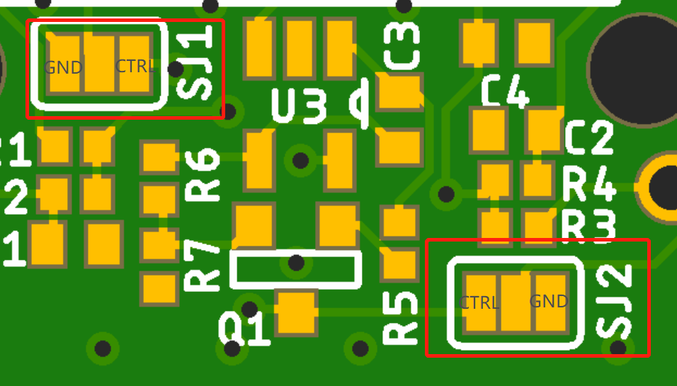

# Robodeck Front gap sensor

## Description
This small board features two TCRT5000 sensors and a votlage controlled current source to control the brightness of the IR LEDs in the sensors if needed/wanted. 
 

## Hardware connections 
Connections marked on the board.

In constant current mode: 
- Solder a resistor on R1 and R3 to set the current 
- Solder JP1 and JP2 to GND

In controlled current mode: 
- Connect CLIFF_CTRL signal to an analog voltage source (ex: STM32 DAC)
- Solder a 0 ohm resistor to R1 and R3
- Solder JP1 and JP2 to CTRL

>Note: the current source feeds both analog sensors together, not individually. 

## Errata
Errors noted when assembling: 
- nothing to note

Testing log:
- Not tested yet

## Open Issues

|Date|Issue|Responsible|Status|
|:---:|:---:|:---:|:---:|
|17.6.2020|In the current schematics, R1&R3 value should be 57.6Ω|||
|10.07.2020|Change componenets as per the below image|||
|20.07.2020|Seperate the TX+2xRX from the board via a dedicated connector|||
|20.07.2020|Future: merge the gap sensor electronics into the mainboard||||

