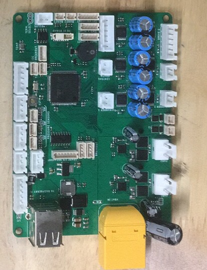

# Robodeck Main Board

## Description
Main controller for motors, sensors and other peripherals. Features:
- 1x STM32F407 100pin microcontroller
- 6x 24V-3A motor drivers with fault detection, current sensing and current limiting
    - 2 with encoder lines
    - 4 simple
- 2x 24V- 10A motor drivers with fault detection, current sensing and current limiting
- 2x N-MOSFET Switches (up to 2A)
- 1x Hall effect current sensor on main input
- 1x Input voltage measurement
- 1x UART breakout
- 1x SPI breakout
- 1x I2C breakout
- 3x pressure sensor connectors
- 1x on board temperature and humidity sensor
- 2x connectors for external temperature sensors
- 2x Cliff sensor connectors
- 1x front gap sensor connector
- 2x 5V servo connectors
- 1x SMBUS BMS connector
- 1x RS-485 transceiver
- 2x bumpers connectors
- 1x SWD programming and debug header
- 1x UI board connector
- 2x USB outputs with power and data (up to 2.5A, data can be disconnected from one of the ports)
- 2x optional breakouts for Brushless ESC (share signal with high power motor drivers)
- 1x spare port breakout

## Hardware connections
Microcontroller

|STM32 Pin | Peripheral| Signal|Notes|Test results|
|:---:|:---:|:---:|:---:|:---:|
|PC9 |**TIM3_CH4**|DRIVE1_A |PWM||
|PC12| GPIO OUT |DRIVE1_B||
|PD13| EXTI_13|DRIVE1_FAULT||  
|PB0| ADC1_CH8||DRIVE1_CURRENT||
|PB2| GPIO OUT| MOTOR_SLEEP |also BOOT1 pin|
|PC8|**TIM3_CH3**|DRIVE2_A |PWM|
|PC11|GPIO OUT|DRIVE2_B||
|PD12|EXTI_12|DRIVE2_FAULT||
|PB1| ADC_CH9|DRIVE2_CURRENT||
|PC6|**TIM3_CH1**|PRESSURE_PUMP_A|PWM|
|PA8|GPIO OUT|PRESSURE_PUMP_B||
|PD10|EXTI_10|PRESSURE_PUMP_FAULT||
|PC7|**TIM3_CH2**|CENTRAL_BRUSH_A|PWM|
|PC10|GPIO OUT|CENTRAL_BRUSH_B||
|PD11|EXTI_11|CENTRAL_BRUSH_FAULT||
|PC5|ADC1_CH5|CENTRAL_BRUSH_CURRENT||
|PE14|**TIM1_CH4**|SCRUBBER1_A|PWM|
|PE15|GPIO OUT|SCRUBBER1_B||
|PB15|EXTI_15|SCRUBBER1_FAULT||
|PA3|ADC1_CH3|SCRUBBER1_CURRENT|PWM|
|PE13|**TIM1_CH3**|SCRUBBER2_A|PWM|
|PE12|GPIO OUT|SCRUBBER2_B||   
|PB14|EXTI_14|SCRUBBER2_FAULT||
|PC4|ADC1_CH14|SCRUBBER2_CURRENT||
|PD1|EXTI_1|BUMPER1||
|PD0|EXTI_0|BUMPER2||
|PD8|EXTI_8|ENCODER1||
|PD9|EXTI_9|ENCODER2||   
|PD15|**TIM4_CH4**|SERVO1|PWM|
|PD14|**TIM4_CH3**|SERVO2|PWM|
|PB8|GPIO OUT|SOLENOID1||
|PB9|GPIO OUT|SOLENOID2||
|PE9|**TIM1_CH1**|STAINING_FAN1_A||
|PE8|GPIO OUT|STAINING_FAN1_B||
|PE6|EXTI_6|STAINING_FAN1_FAULT||
|PE11|**TIM1_CH2**|STAINING_FAN2_A||
|PE10|GPIO OUT|STAINING_FAN2_B||
|PE7|EXTI_7|STAINING_FAN2_FAULT||
|PB6|I2C1_SCL|SCL||
|PB7|i2C1_SDA|SDA||
|PD6|USART2_RX|RS485_RX||
|PD5|USART2_TX|RS485_TX||
|PE0|GPIO OUT|RS485_DIR||
|PB4|SPI1_MISO|MISO||
|PB5|SPI1_MOSI|MOSI||
|PD7|GPIO OUT|CS||
|PB3|SPI1_SCK|SCK||
|PA12|USB_DP|D_P||
|PA11|USB_DN|D_N||
|PA13|SWDIO|SWDIO||
|PA14|SWCLK|SWCLK||
|PA9|USART1_TX|USART1_TX||    
|PA10|USART1_RX|USART1_RX||
|PB11|I2C2_SDA|SMBUS_SDA||
|PB10|I2C2_SCL|SMBUS_SCL||     
|PB12|I2C2_SMBA|SMBUS_ALERT||
|PAB13|GPIO OUT|SMBUS_IO||
|PC2|ADC1_CH12|CLIFF1_OUT||
|PC3|ADC1_CH13|CLIFF2_OUT||
|PC0|ADC1_CH10|GAP_SENSE_1||
|PC1|ADC1_CH11|GAP_SENSE_2||
|PD4|EXTI_4|ONxOFF|from UI Board|
|PD3|EXTI_3|STARTxSTOP|from UI Board|
|PD2|EXTI_2|CLEANxSTAIN|from UI Board|
|PA4|DAC_1|GAP_CTL|to front gap sensor|
|PA5|DAC_2|CLIFF_CTL|to both cliff sensors|
|PC15|GPIO IN|EXT_TEMP2| DS18B20 temp sensor|  
|PC14|GPIO IN|EXT_TEMP1| DS18B20 temp sensor|  
|PA0|ADC1_CH0|PRESSURE1||
|PA6|ADC1_CH6|PRESSURE2||
|PA15|**TIM2_CH1**|BUZZER|st equivalent for tone library?|
|PA7|ADC1_CH7|PRESSURE3||GPIO OK|
|PE3|GPIO OUT|AMUX_S0|channel selection on analog mux|
|PE4|GPIO OUT|AMUX_S1|channel selection on analog mux|
|PE5|GPIO OUT|AMUX_S2|channel selection on analog mux|
|PA1|ADC1_CH1|AMUX_OUT|analog mux output|
|PA2|ADC1_CH2|LxCURRENT|current sensor output|
|PE1|GPIO OUT|SPARE_GPIO1||
|PE2|GPIO OUT|SPARE_GPIO2||

Signals from Analog Mux:
|Channel|S0/S1/S2|Signal|
|:---:|:---:|:---:|
|Y0|0/0/0|STAINING_FAN2_CURRENT|
|Y1|1/0/0|STAINING_FAN1_CURRENT|
|Y2|0/1/0|PRESSURE_PUMP_CURRENT|
|Y3|1/1/0|BAT_MEAS|
|Y4|1/0/0|-|
|Y5|1/0/1|SPARE_ANALOG1|
|Y6|1/1/0|-|
|Y7|1/1/1|SPARE_ANALOG2|

## Programming

- Using SWD: You can use a programmer (ex: Jlink or STlink) to program the baord via SWD. I included a cable with dupont wires to make it easier for you. If you have an ST development board (discovery or nucleo), you can usually re-use the STlink that is embedded on that baord to flash an external chip.

>if you are using Visual Studio Code, check out this [tutorial](https://github.com/rayan4444/vs_code_setup_tutorials/tree/master/STM32) to set up your development environment for STM32:
- Using UART: All STM32 chips come with a bootloader that lets you use UART to program them. If for some reason you don't want to use SWD to program the chip, you can still use UART. However this will require you to modify the PCB a little. In this version pin Boot 0 pulled low and pin PB2 pulled high. To use UART flashing Boot0 needs to be high and PB2 low. If needed, consult [this tutorial](http://stm32f4-discovery.net/2014/09/program-stm32f4-with-uart/)

## Errata
Manufacturing errors:
- test points names not marked on bottom silkscreen (layer missing from gerber?)
- inner layers shorted on milled slot for xt90 connector resulting in short between power and ground: to fix, saw off the milled slot on current boards. And in the future make sure to modify the library part

Errors noted when assembling:
- Pin 1 marking for analog mux is missing
- VBAT in polarity not marked on silkscreen
- XT90 connector polarity flipped (+ side on the circuit corresponds to the - side of the connector)
- Diode marking missing on FET switches
- +/-  markings missing on FET connectors
- wrong footprint for input 100uF through hole capacitor (too small)

Testing log:
- Board 0 (in shenzhen): many soldering issues. to be debugged gradually
- Board 1: 24V buck OK (5.35V, perfect), LDO OK (3.3V), Can prorgam through SWD. other peripherals not tested.
- Board 2: 24V buck OK (5.35V, perfect), LDO OK (3.3V), Can prorgam through SWD. other peripherals not tested.
- Board 3: 24V buck OK (5.38V, good), LDO OK (3.3V), Can program through SWD, other peripherals not tested.

> Some boards have burnt connectors. from debugging, sorry. one of them also has the main ninput capacitors missing, you can easily solder them up

>Note from Rayan: on all the boards I sent I did not solder the ferrite bead that connects GND and AGND because it made it easy to do basic tests. You can choose to use the ferrite bead from the BOM or short the connection with a 0 ohm resistor or some tin.

Other design errors:
- DRV8701 AVDD connected to 3.3v in V1. Make sure to disconnect AVDD from the 3.3v rail else the drivers overheat and don't work.
- Missing power on led indicator
