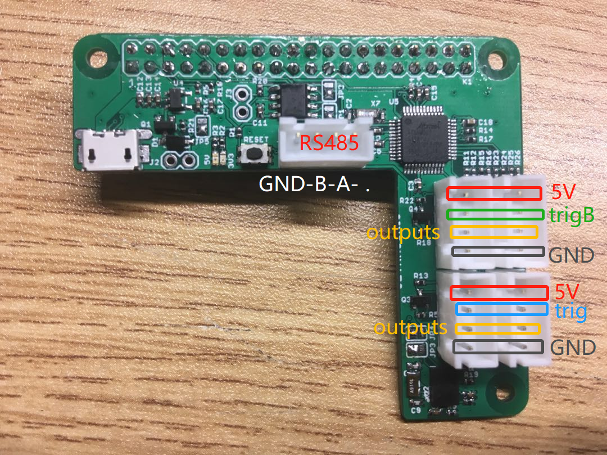
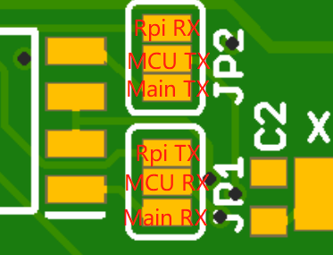
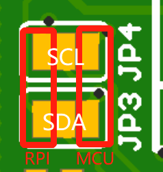

# Raspberry Pi Hat

## Description
This board plugs onto a Raspberry pi and features:
- 1x ATSAMD21G18 MCU (Arduino Zero)
- 1x BNO055 IMU with jumpers to select the I2C host: Raspberry Pi or MCU
- 1x RS-485 transciever with jumper to select the UART host: Raspberry Pi or MCU
- 4x connectors for Ultrasonic sensors
- 1x FET driver for a small 5V fan to cool down the RPi

## Programming
The MCU on this board can normally be programmed directly via it's native USB port (using the microUSB connector on the board and in the Arduino IDE, choose Arduino Zero native USB as your Board. You might have to double-press the reset button before flashing). However the first time you use it, you need to burn the Arduino Zero bootloader on it first, using the SWD pins.

In this board, the SWD pins are connected to the Raspberry Pi connector so you can use the Raspberry pi to burn the bootloader, like explained in [this tutorial](https://learn.adafruit.com/programming-microcontrollers-using-openocd-on-raspberry-pi).

The soldered boards sent already have the Arduino bootloader burned and can be programmed directly.

## Hardware connections

MCU:

|ATSAMD21G18 Pin|Arduino Pin|Signal| Notes|
|:---:|:---:|:---:|:---:|
|PA5| A4 or 18|FAN_MCU| to toggle cooling fan from the MCU|
|PA10|1 or TX|MCU_TXD||
|PA11|0 or RX|MCU_RXD||
|PA12|22|RS485_DIR| controlling RS485 transceiver direction|
|PA15|5~|TRIG_B_| trigger pin for one pair of ultrasonic sensors|
|PA16| 11~|TRIG_|trigger pin for the other pair of ultrasonic sensors|
|PA17|13~|ECHO1| interrupt enabled|
|PA18|10~|ECHO2| interrupt enabled|
|PA19|12~|ECHO3|interrupt enabled|
|PA20|6~|ECHO4| interrupt enabled|
|PA21|7|IMU_INT| interrupt enabled|
|PA22|SDA|MCU_SDA| to IMU|
|PA23|SCL|MCU_SCL| to IMU|
|PA24|USB D-|USBD_N| to micro USB connector, for programming|
|PA25|USB D+|USBD_P| to micro USB connector, for programming|
|PA30|SWCLK|SWCLK|To Rpi,  for first time bootloader burning|
|PA31|SWDIO|SWDIO|To Rpi,  for first time bootlader burning|

Raspberry Pi:

|Raspberry Pi GPIO|Raspberry Pi Pin|Signal|Notes|
|:---:|:---:|:---:|:---:|
|GPIO 2|3|RPI_SDA|to IMU|
|GPIO 3|5|RPI_SCL|to IMU|
|GPIO 4|7|FAN_PI| to toggle cooling fan from the Rpi|
|GPIO 14|8|RPI_TX|RPI UART|
|GPIO 15|10|RPI_RX|RPI UART|
|GPIO 17|11|IMU_RST|to IMU|
|GPIO 18|12|RESET||
|GPIO 27|13|IMU_INT| to IMU|
|GPIO 24|18|MCU SWDIO|To burn bootloader to the MCU|
|GPIO 25|22|MCU SWCLK|To burn bootloader to the MCU|

Connectors:
- see pictures above

Jumper options:
- JP1 and JP2: select whether the MCU's UART talks to the Main board through RS485 or directly to the RPI
- JP3 and JP4: select whether the IMU connects to the MCU or the RPi

## Errata
Errors noticed when assemling:
- Pin 1 of IMU hard to spot
- Diode direction missing on D1
- R7 and C8 silkscreen unclear
- Ultrasonic sensors and RS485 connectors don't have a labelled pinout

Testing log:
- Tested all boards, bootloader burned.
- Communication with the IMU was tested with the Arduino MCU (I2C address 0x28): the jumpers were then set to commnuicate with the Raspberry Pi, but that communication hasn't been tested.
- Board 1: no problems
- Board 2: 5V red LED doesn't turn on but board works fine
- Board 3: no problems
