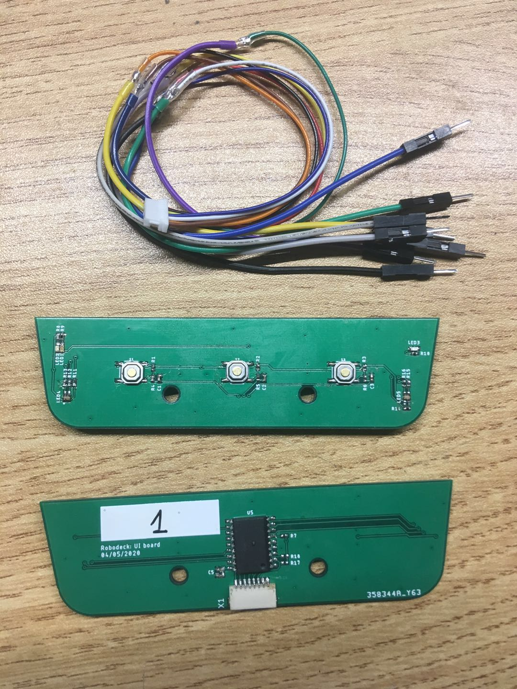

# UI board 

## Description
This board has the buttons and LED indicators for user interface:
* 3x momentary push buttons with some hardware debouncing
* 2x RGB LEDs, common anode.
* 1x Blue LED
* 1x Red LED tied to a green LED (tristate control)

## Hardware connections
On JST SH (1mm spacing) 8pin connector side, left to right:
|Pin|Signal| Notes|
|:---:|:---:|:---:|
|1|3V3|Supply to the board|
|2|Clean/Stain Button|LOW when pressed |
|3|Start/Stop Button|LOW when pressed|
|4|On/Off Button|LOW when pressed|
|5|I2C SCL|3.3V level, footprints for pullup resistors are available but not populated by default|
|6|I2C SDA|3.3V level, footprints for pullup resistors are available but not populated by default|
|7|GND||
|8|GND||

## Test sketch
There is an Arduino sketch to test the basic features of the UI board. A test cable with male Dupont ends is provided to help connect the UI board to a breadboard, Arduino or other development boards.

## Errata
Errors noted when assembling:
- MCP220008 pin one marking missing
- C4 and C5 silkscreen unclear
- LED cathode markings covered or too small
- LED1 and LED2 a little too close.

Test report:
- Board 1: nothing wrong so far
- Board 2: nothing wrong so far
- Board 3: nothing wrong so far
